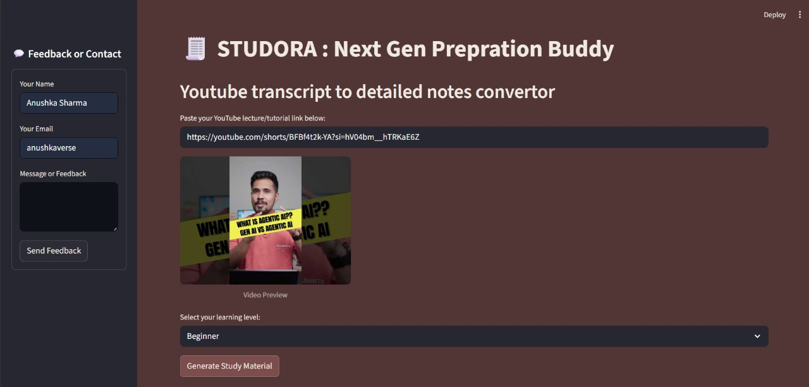

# 🎓 Studora — Your Next Gen Preparation Coach 📚

**Studora** is a modern AI-powered study assistant that transforms YouTube lecture/tutorial videos into structured, downloadable study materials — all in one click. Built using **Streamlit**, **Python**, and **Google Gemini API**, Studora helps students instantly generate summaries, flashcards, revision plans, and extra resources from any educational video.

---

## ✨ Features

- 🔗 **YouTube to Notes**  
  Paste any public YouTube lecture/tutorial URL and get study material in seconds.

- 🎓 **Learning Level Personalization**  
  Choose from Beginner, Intermediate, or Advanced to tailor the output's complexity.

- 📝 **Smart Summarization**  
  Extracts meaningful points using Gemini AI with difficulty-specific tone.

- 🃏 **Auto Flashcard Generator**  
  Converts content into quick-revision Q&A flashcards.

- 📅 **5-Day Revision Plan**  
  AI-crafted schedules with topic focus, time estimates & sample questions.

- 🔗 **Extra Learning Resources**  
  Curated external videos/articles for deeper understanding.

- 📥 **Downloads in TXT & PDF**  
  Export any generated content for offline study.

- 📊 **Study Dashboard & History**  
  Auto-saves every session and displays a personalized dashboard.

- 💌 **Feedback Form**  
  Collects user insights via sidebar form.

---

## 🧑‍💻 Tech Stack

| Area              | Tools Used                          |
|-------------------|-------------------------------------|
| Frontend          | Streamlit                           |
| Backend           | Python 3.10+                        |
| AI Model          | Google Gemini (via `google-generativeai`) |
| Transcript Engine | `youtube-transcript-api`            |
| Styling & Export  | Custom HTML/CSS, FPDF               |
| Environment       | dotenv (`.env`) for API key storage |

---
## 🖼️ Visual Preview

| Main Interface | Summary Tab | Flashcards |
|----------------|-------------|------------|
|  |  |  |

| Revision Plan | Resources |
|---------------|-----------|
|  |  |

---

## 🚀 Getting Started

### 1. Clone the Repository
```bash
git clone https://github.com/anushkaverse/Studora.git
cd Studora
```

### 2. Install Requirements
It is recommended to use a virtual environment:
```bash
python -m venv venv
source venv/bin/activate  # On Windows: venv\Scripts\activate
pip install -r requirements.txt
```

### 3. Set Up Google Gemini API Key
- Create a `.env` file in the project root:
  ```
  GOOGLE_API_KEY=your_gemini_api_key_here
  ```
- [Get your Gemini API key here.](https://ai.google.dev/gemini-api/docs/get-api-key)

### 4. Run the App
```bash
streamlit run app.py
```

The app will open in your browser at `http://localhost:8501`.

---

## 🗂️ Project Structure
```
├── app.py                # Main Streamlit app
├── core.py               # Core logic (YouTube, Gemini, etc.)
├── requirements.txt      # Python dependencies
├── feedback.txt          # Stores user feedback
├── .env                  # Your Gemini API key (not committed)
├── screenshots/          # App screenshots for README
└── ...
```


---

## 📄 License

MIT License
